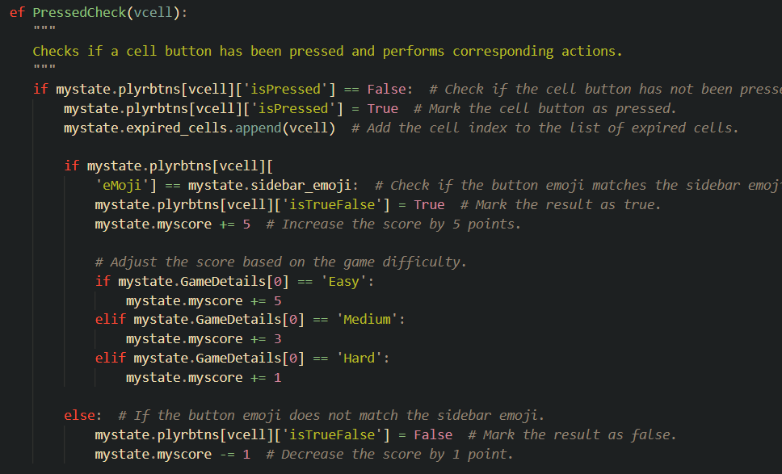

# Requistos vs código
## Requisitos Funcionales y Criterios de Aceptación

| Requisito y Criterios de Aceptación                                   | Código/Imagen                         |
|-----------------------------------------------------------------------|---------------------------------------|
| **1. Configuración de Nivel de Dificultad** **Requisito:** El sistema debe permitir a los jugadores seleccionar el nivel de dificultad antes de comenzar el juego. **Criterios de Aceptación:** - Opciones de dificultad fácil, medio y difícil disponibles para selección. - La configuración de dificultad debe influir en la mecánica del juego, como la frecuencia de regeneración de imágenes y la puntuación. - Tiempos de regeneración específicos:   - Fácil: cada 8 segundos.   - Medio: cada 6 segundos.   - Difícil: cada 5 segundos. |                    |
| **2. Inicialización del Tablero** **Requisito:** Al comenzar un juego, el sistema debe inicializar el tablero con un conjunto aleatorio de imágenes basado en la dificultad seleccionada. **Criterios de Aceptación:** - El tablero debe ser llenado con imágenes de emojis que corresponden a la dificultad elegida. - Ninguna imagen objetivo (emoji de la barra lateral) debe aparecer más de una vez en el tablero inicial. - La imagen objetivo debe ser seleccionada aleatoriamente y mostrada en la barra lateral. |                |
| **3. Parametrización del Nombre del Jugador y País** **Requisito:** El sistema debe permitir a los jugadores ingresar su nombre y país antes de comenzar el juego. **Criterios de Aceptación:** - Debe existir un campo de texto para que los jugadores ingresen su nombre y país. - Es posible que los campos de nombre y país estén vacíos, pero en ese caso no se muestra el _Leaderboard_ - La información del jugador debe persistir durante la sesión de juego. |   |
| **4. Interacción del Jugador** **Requisito:** Los jugadores deben poder interactuar con la matriz de juego al presionar botones. **Criterios de Aceptación:** - Se deben proporcionar botones para que el jugador elija las imágenes que desea seleccionar en la matriz. - Al presionar un botón, se debe actualizar el estado de la matriz y el puntaje del jugador. - La selección de imágenes debe ser limitada según las opciones disponibles en cada momento. |   |
| **5. Puntuación del Jugador** **Requisito:** El sistema debe mantener un registro de la puntuación del jugador durante el juego. **Criterios de Aceptación:** - La puntuación debe aumentar cada vez que el jugador realiza una acción válida, como seleccionar una imagen correcta. - La puntuación debe disminuir cada vez que el jugador realiza una acción válida, como seleccionar una imagen incorrecta. - La puntuación debe mostrarse claramente al jugador en todo momento durante el juego. |   |
| **6. Líderes y Tablero de Puntuación** **Requisito:** El sistema debe incluir un tablero de puntuación para mostrar las puntuaciones más altas. **Criterios de Aceptación:** - Se debe mantener un registro de las puntuaciones más altas de los jugadores. - El tablero de puntuación debe ser visible para los jugadores y mostrar las puntuaciones más altas junto con los nombres de los jugadores. - Debe haber una opción para restablecer el tablero de puntuación si es necesario. |   |
